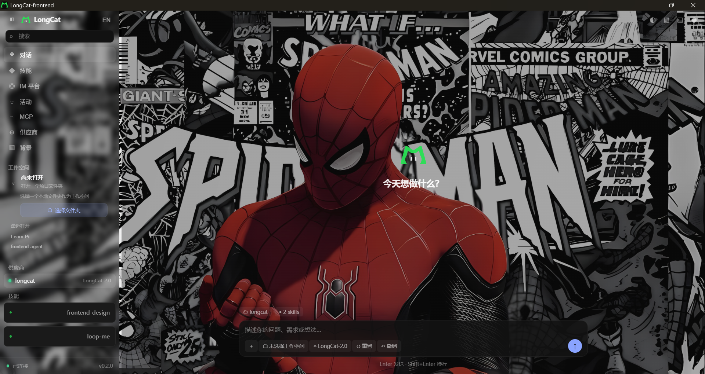
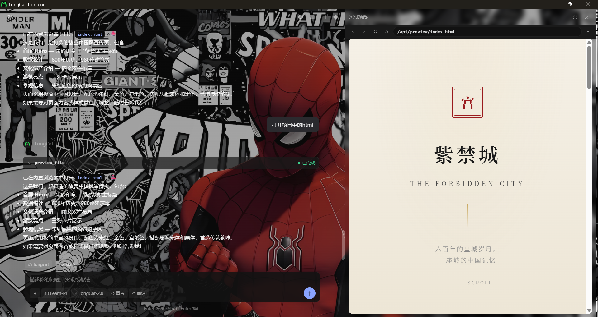
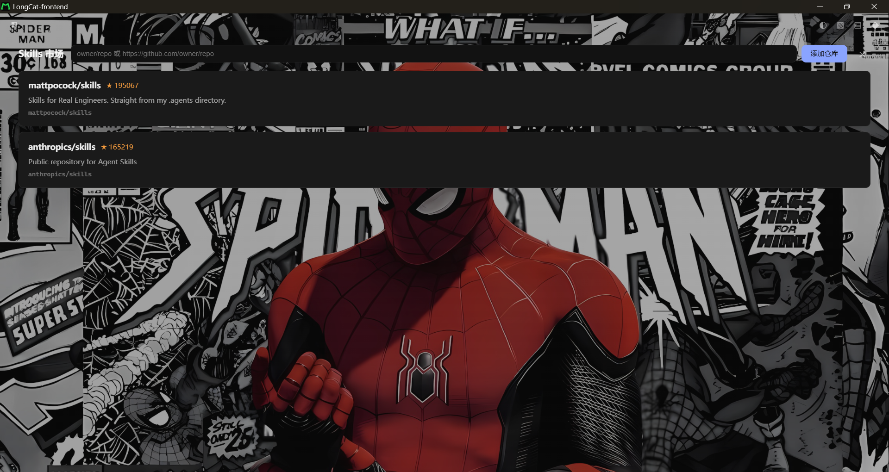
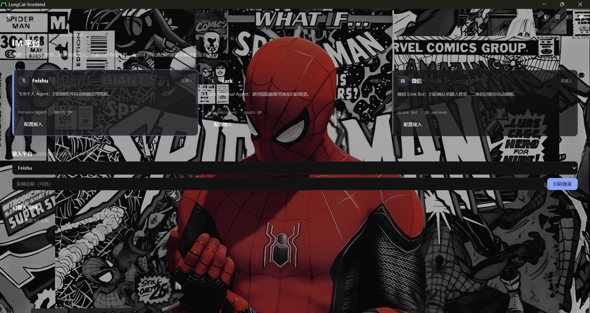
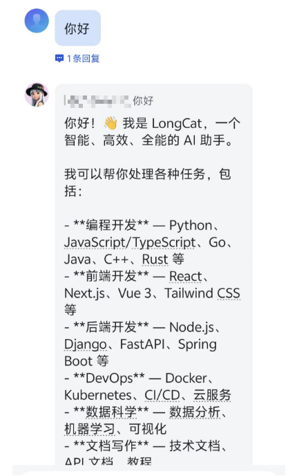
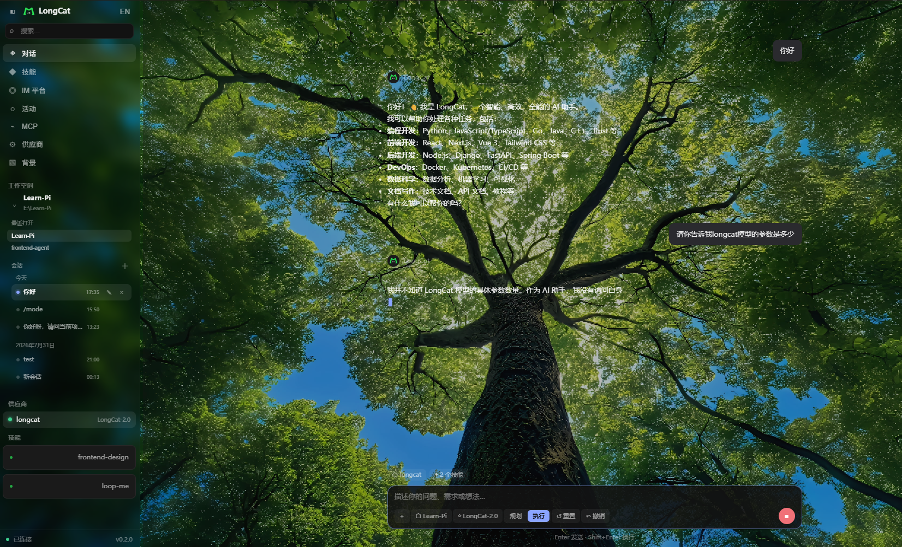
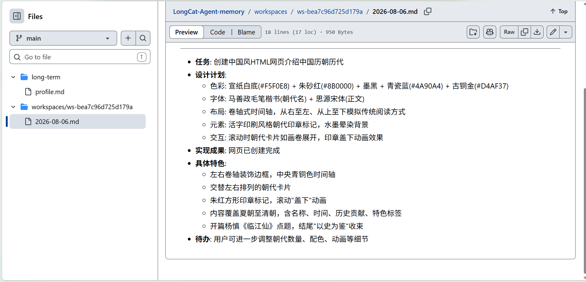
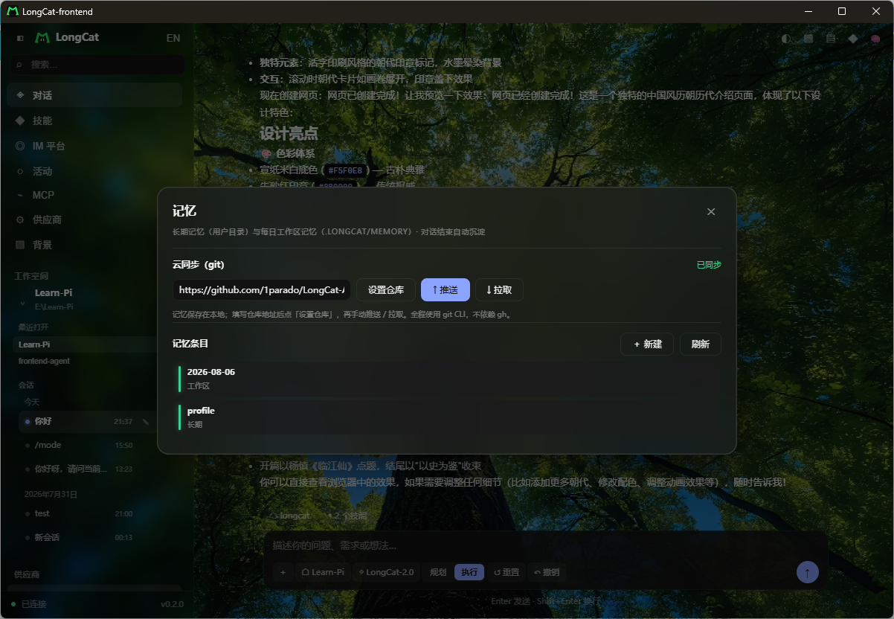
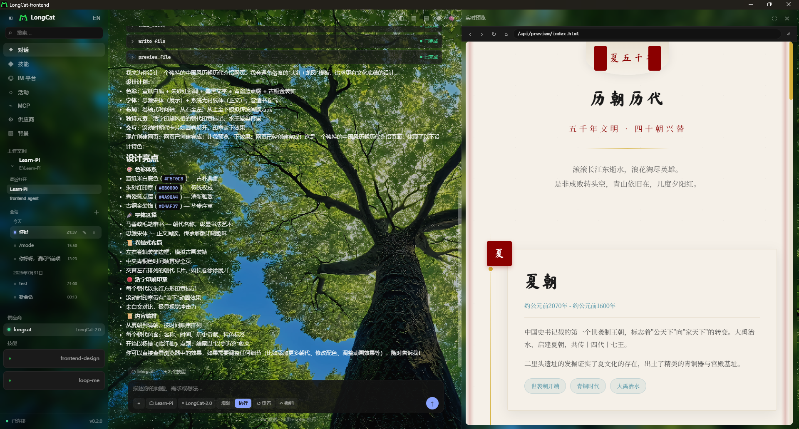

# LongCat-frontend

轻量级前端开发 Agent，专注于 React、Next.js、Vue 3、Svelte、Tailwind 和设计系统开发。

## 项目介绍

| 项目 | 说明 |
| --- | --- |
| 类型 | 前端开发 Agent |
| 运行方式 | TUI、Web UI、Tauri 桌面应用 |
| 后端 | Go |
| 桌面端 | Tauri v2 |
| 模型协议 | OpenAI Chat、OpenAI Responses、Anthropic Messages、Ollama |
| Agent 能力 | 文件读写、预览、Diff、Undo、MCP 工具调用 |
| Skills | 支持项目级和市场技能管理 |
| IM 平台 | 支持 Feishu、Lark、微信扫码接入 |
| 工作区 | 支持多工作区、多会话和本地持久化 |

## 界面预览

| 应用主页 | 内置浏览器 |
| --- | --- |
|  |  |

| Skills 管理 | IM 平台 |
| --- | --- |
|  |  |

| IM 平台对话 | 流式输出 |
| --- | --- |
|  |  |

## 记忆机制

LongCat-frontend 内置双层记忆系统。每次对话结束后，Agent 会异步抽取关键信息并落盘；新会话开始时，再把历史记忆注入系统提示词，让 Agent "记得你之前说过什么"。

### 1. 双层记忆：工作区记忆 + 长期记忆



上图是记忆文件在远程 GitHub 仓库中的真实组织。系统按作用域分成两类文件：

| 类型 | 路径 | 作用域 |
|---|---|---|
| **工作区记忆** | `<workspace>/.longcat/memory/YYYY-MM-DD.md` | 跟随当前项目，按天累积 |
| **长期记忆** | `~/.longcat-frontend/memory/long-term/*.md` | 跟随用户目录，跨项目可用 |

- 工作区记忆记录当前项目里的设计决策、未决事项、实现细节等。
- 长期记忆沉淀个人偏好、跨项目约定、用户画像等"关于你"的内容。

### 2. 自动沉淀 → 提示词回流

对话结束时，后台会调用 `memory.RecordTurn`（带 `context.WithoutCancel` 与 30s 超时），由 LLM 抽取要点后写入对应文件；新会话在 `buildSystem` 阶段通过 `memory.LoadContext` 读取并按作用域拼接到系统提示词。写入/读取都是纯 Markdown 文件，无需数据库，天然可审计。

### 3. 云同步面板（手动 git 同步）



Web UI 右上角标题栏的 🧠 按钮打开记忆面板，支持：

- 设置专用 memory 仓库地址（如 `https://github.com/1parado/LongCat-Agent-memory.git`）
- 手动 `↑ 推送` / `↓ 拉取`
- 查看「工作区」与「长期」两类记忆条目
- 新增、编辑、删除单条记忆

> **云同步不自动**，只在用户点击按钮时执行；底层全程使用纯 `git` CLI，不依赖 `gh api`。由于后台进程没有 TTY，首次推送前需要通过 Git Credential Manager 缓存凭据，或在仓库 URL 内嵌 GitHub PAT。

### 4. 桌面端入口



桌面端启动后，点击标题栏的 🧠 即可打开记忆面板，查看或同步记忆。记忆服务随应用一起启动，无需额外配置。

## 快速启动

```bash
# TUI / CLI 模式
./bin/LongCat-frontend.exe

# 本地 HTTP + Web UI 模式
go run ./cmd/LongCat-frontend serve -addr 127.0.0.1:5510

# 桌面端开发
cd desktop/src-tauri
cargo tauri dev
```

详细说明见 [`AGENTS.md`](AGENTS.md)、[`DESIGN.md`](DESIGN.md) 与 [`如何启动和验证WebUI.md`](如何启动和验证WebUI.md)。

## License

MIT
