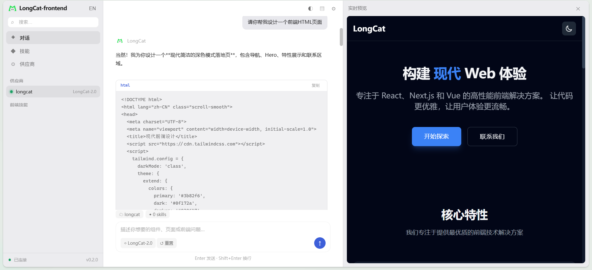

# LongCat-frontend

<p align="center">
  
</p>

轻量级、以体验为先的前端开发 Agent。只做前端，不做通用编码：专注 React / Next.js（App Router）、Vue 3、Svelte、Tailwind 以及设计系统与组件生成、无障碍、性能优化。

## 特性

- **多形态运行**：终端 TUI（`tui`）+ 桌面后端（`serve`，HTTP API + Web UI），可配合 Tauri 桌面壳使用。
- **自定义 LLM 供应商**：只需 `URL + API Key + Protocol` 即可接入，支持 `openai_chat` / `openai_responses` / `anthropic_messages` / `ollama_chat`，并提供增删改查与切换。
- **前端技能系统**：`frontend-skills/` 下按目录组织的前端专属技能（React 组件、Next.js App Router、Vue 3 组件、Tailwind 样式、无障碍等），按关键词自动匹配。
- **Web UI**：内嵌单文件界面，grok 风深色主题 + LongCat 品牌图标，支持中英文（zh-CN / en-US）切换与本地持久化。
- **轻量**：Go 标准库实现，构建产物 < 10 MB，无后台常驻进程。

## 界面预览



## 目录结构

```
LongCat-frontend/
├── cmd/LongCat-frontend/main.go   # 程序入口
├── internal/
│   ├── agent/                     # 核心 Agent 逻辑与前端提示词
│   ├── ui/                        # 终端 TUI
│   ├── frontend/                  # 前端技能加载与匹配
│   ├── llm/                       # LLM 多协议接入与供应商管理
│   └── server/                    # HTTP 服务 + 内嵌 Web UI
├── frontend-skills/               # 前端专属技能（React / Vue3 / Tailwind ...）
├── desktop/src-tauri/             # Tauri v2 桌面壳（Rust sidecar 启动 Go 后端）
├── go.mod
└── README.md
```

## 快速开始

需要 Go 1.23+。

### 构建

```bash
cd LongCat-frontend
go build -o bin/LongCat-frontend.exe ./cmd/LongCat-frontend
```

也可直接使用仓库提供的脚本：`run.cmd`（Windows）或 `run.ps1`。

### 配置供应商

```bash
# 添加一个 OpenAI 兼容供应商
LongCat-frontend provider add \
  -id my -url https://api.openai.com/v1 \
  -key sk-xxx -protocol openai_chat -model gpt-4o-mini

# 列出 / 切换 / 删除
LongCat-frontend provider list
LongCat-frontend provider use my
LongCat-frontend provider remove my
```

配置保存在用户主目录 `~/.longcat-frontend/providers.json`（不随仓库提交）。

### 运行

```bash
# 终端 TUI（默认）
LongCat-frontend tui

# 桌面后端（默认监听 127.0.0.1:5510），浏览器打开即可使用 Web UI
LongCat-frontend serve
LongCat-frontend serve -addr 127.0.0.1:5510
```

### 桌面应用

`desktop/src-tauri` 为 Tauri v2 桌面壳，使用 Rust sidecar 启动上面构建的 Go 后端。需要 Rust 工具链：

```bash
cd desktop
cargo build
```

## 协议支持

`openai_chat` · `openai_responses` · `anthropic_messages` · `ollama_chat`


